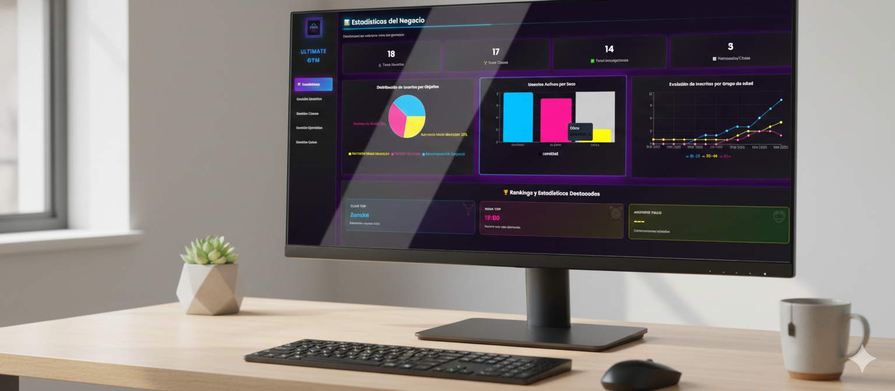
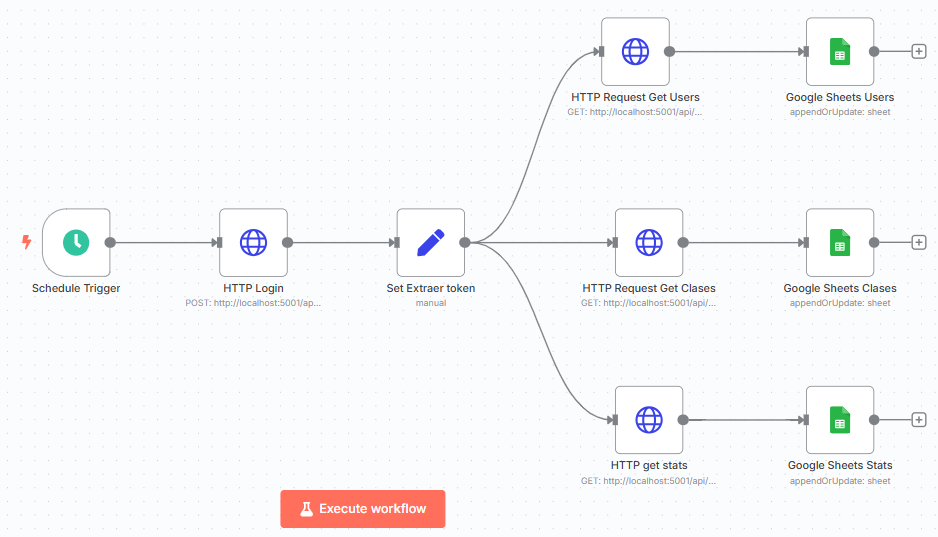

# UltimateGym

**Autor:** Iván Pons Martínez Link de linkedin: www.linkedin.com/in/iván-pons-martínez-617609183

¡Bienvenido/a a UltimateGym! 🏋️‍♂️

Este es mi proyecto fullstack, Una app de gimnasio moderna, con frontend en React (Vite) y backend Node.js/Express/MongoDB. Si eres recruiter, compañer@ dev o simplemente te gusta, aquí tienes un ejemplo realista y funcional.

---

## 📱 Vista previa

<div align="center">
  
  
  
</div>

---

## ¿Qué es esto?

UltimateGym es una SPA fullstack completa donde puedes:
- Registrarte y loguearte con autenticación JWT y roles (user/admin)
- Ver y apuntarte a clases de gimnasio
- Consultar y filtrar ejercicios por grupo muscular y equipamiento (con imágenes)
- Descargar guías en PDF personalizadas
- Panel de admin completo para gestionar usuarios, clases, ejercicios y guías
- Estadísticas detalladas (usuarios por objetivo, clases populares, inscripciones, análisis por día)
- Exportación de datos de usuarios y clases (preparado para automatizar a Excel con n8n)
- **Envío automático de guías por email** a través de n8n
- Chat en vivo con Landbot
- Accesibilidad real (widgets, skiplinks, contraste, etc.)

Todo con seeds de ejemplo para que lo veas funcionando nada más clonar.

---

## Tecnologías y stack

- **Frontend:** React 19, Vite, CSS Modules, Recharts
- **Backend:** Node.js, Express, MongoDB (Mongoose), Multer
- **Auth:** JWT, roles, bcryptjs
- **Otros:** Landbot, n8n (webhook para emails), variables de entorno, seeds automáticos

---

## ¿Cómo lo pruebas?

1. Clona el repo y entra en la carpeta
2. Copia `.env.example` a `.env` y pon tus datos (o deja los de local para probar)
3. Instala dependencias:
   - npm install

4. Ejecuta los seeds para tener datos de ejemplo:
   
   - node backend/seeds/index.js
5. Arranca todo (backend y frontend a la vez):
   ```
   npm run dev:all
   ```
6. Abre [http://localhost:3000](http://localhost:3000) y explora la app


---

## Configuración opcional

Estas características están implementadas en el proyecto y funcionan si las configuras:

- **n8n (automatizaciones):** Conecta tu instancia de n8n para activar automáticamente:
  - Envío de emails con guías personalizadas a usuarios
  - Exportación automática de datos a hojas Excel
  - Otros flujos de automatización que diseñes
  
  Configura `N8N_WEBHOOK_URL` en tu `.env` con tu webhook de n8n. Sin esta configuración, el proyecto funciona normalmente pero sin las automatizaciones.
  
  **Ejemplos de flujos de n8n implementados:**
  
  *Automatización de envío de guías por email:*
  
  
  *Exportación automática de datos a Excel:*
  
  
  *Se conoce que lo que se ha realizado con n8n se podría hacer de otras formas en código directamente pero se quería probar n8n en este proyecto para aprender formas diferentes de hacerlo*

  **Si quieres probar a hacerlo en código puedes utilizar las librerías nodemailer, exceljs etc.**


- **Landbot (chat en vivo):** El ChatBot funcionará correctamente porque está el link del landbot siempre en escucha. Si quieres insertar otro modifica el enlace del LandBot.

---

## Cosas interesantes del código

- Estructura clara: **MVC en backend**, componentes y contextos en frontend
- Seeds con imágenes de ejemplo (¡no más apps vacías al clonar!)
- **Autenticación JWT con roles** (user/admin) y validaciones completas
- **Sistema de automatizaciones** integrado con n8n para envíos de emails y exportaciones
- **Estadísticas avanzadas** con agregaciones MongoDB en tiempo real
- **Filtros y búsquedas bidireccionales** (frontend y backend)
- **Panel admin real** con gestión completa de usuarios, clases, ejercicios y guías
- **Gráficas interactivas** con Recharts (lineal, circular, de barras)
- **Gestión de archivos** (PDF y imágenes) con multer y almacenamiento en servidor
- **Accesibilidad de verdad**, no solo por cumplir (WCAG compliance)
- Código comentado y limpio, sin relleno ni funciones muertas
- Variables de entorno bien documentadas

---


Cualquier cosa, puedes escribirme al Linkedin 😉